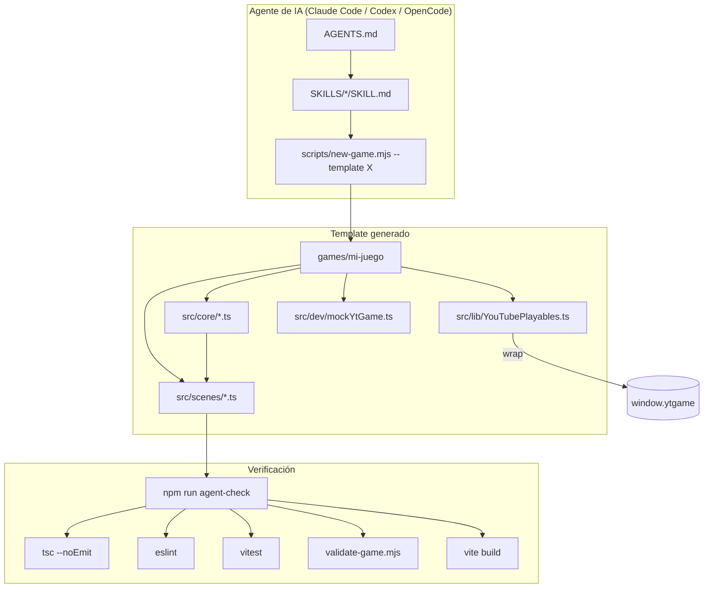

# Arquitectura

Diagrama de capas del scaffold. Cada juego generado es una copia independiente
de uno de estos templates — no hay dependencias compartidas en tiempo de
ejecución entre `games/*`.

## Capas y responsabilidades

| Capa | Responsabilidad | No debe hacer |
|---|---|---|
| `lib/YouTubePlayables.ts` | Único punto de contacto con `window.ytgame` | Lógica de gameplay |
| `core/*.ts` | Sistemas genéricos reutilizables entre géneros (input, audio, guardado, i18n, UI, pooling, FSM, juice, niveles) | Nada específico de un juego concreto |
| `scenes/*.ts` | Flujo del juego (Boot → Preloader → MainMenu → Game → GameOver) | Reimplementar lo que ya resuelve `core/` |
| `dev/mockYtGame.ts` | Simular el SDK en desarrollo local | Aparecer en el build de producción (se elimina por tree-shaking vía `import.meta.env.DEV`) |
| `scripts/*.mjs` | Generación y validación automatizada, fuera del bundle del juego | Ejecutarse dentro del navegador/juego |

## Por qué templates self-contained (no monorepo con paquete compartido)

Se consideró extraer `core/` a un paquete npm compartido (`@playables-sdk/core`)
usado por los 4 templates vía workspaces. Se descartó deliberadamente:

- El template oficial de Phaser para Playables (`phaserjs/template-youtube-playables`)
  también es self-contained — es el patrón que la comunidad y Google esperan
  ver en un repo de Playables.
- Un agente de IA generando un juego con `new-game.mjs` obtiene una copia
  *completa e independiente*: puede modificar `core/` libremente para ese
  juego específico sin arriesgar romper otros juegos que compartan el mismo
  paquete.
- El costo (algo de duplicación de código entre templates) es aceptable
  frente al beneficio (aislamiento total, cero riesgo de romper un juego
  publicado al tocar el scaffold).

Si en el futuro se vuelve un problema real de mantenimiento (mismo bug
corregido 4 veces en 4 templates), migrar a workspaces es una opción — pero
no antes de que ese dolor sea real y medido.
